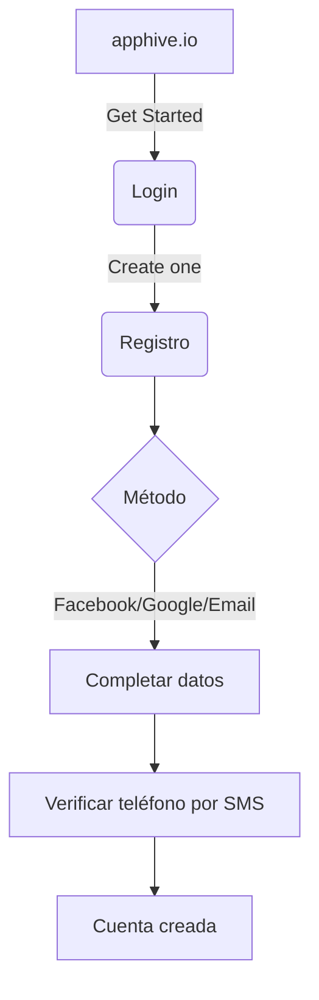

# Flujos de trabajo — Lección 1

## Registro de cuenta


## Creación de proyecto y apps
```mermaid
graph TD
  A[Dashboard] --> B[Project's name]
  B --> C[Start without template]
  C --> D[Icono + Plan Free]
  D --> E[Create]
  E --> F[Editor]
  F --> G[Project dashboard]
  G --> H[New app (Anunciante/Admin)]
```